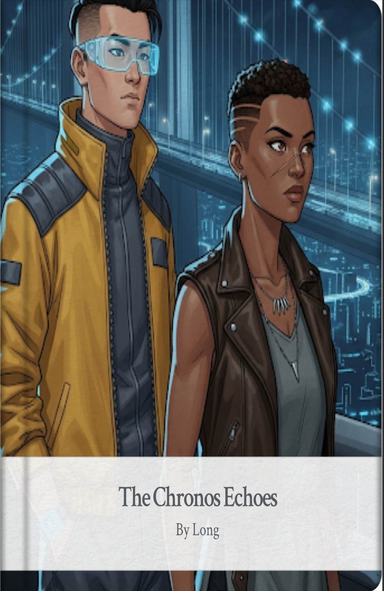
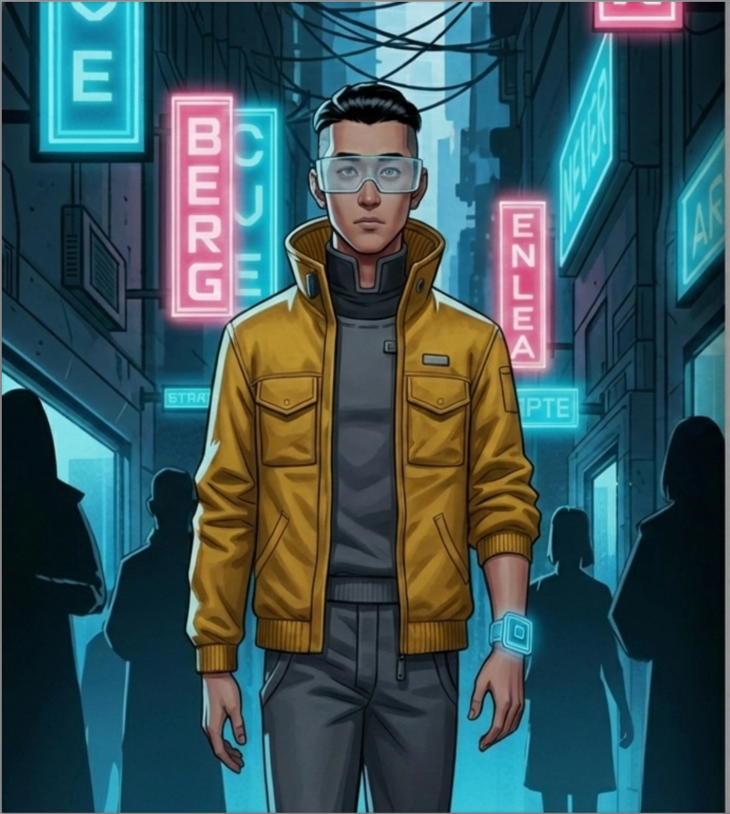
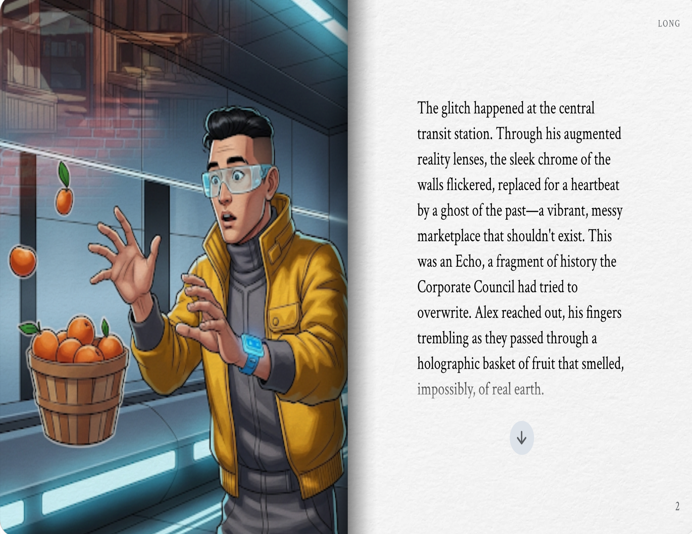
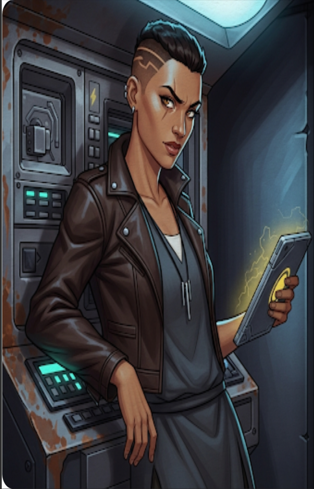
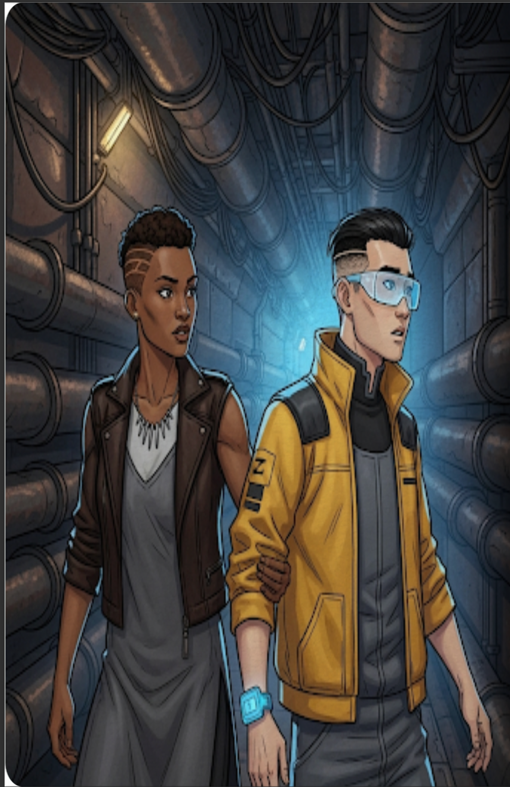
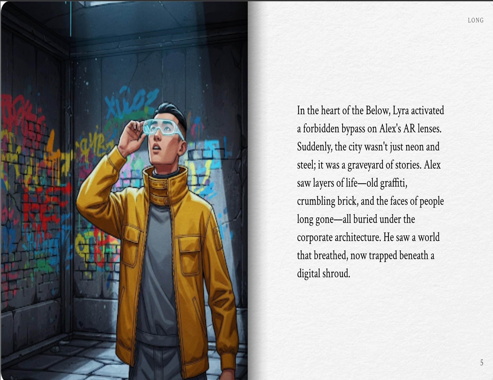
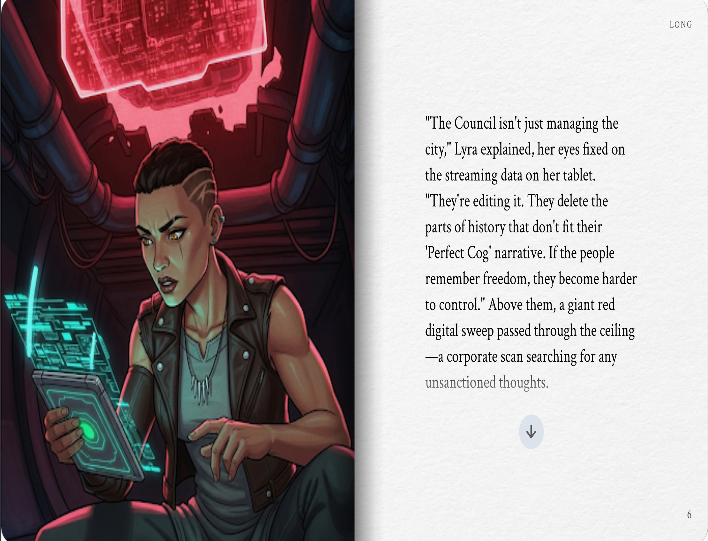
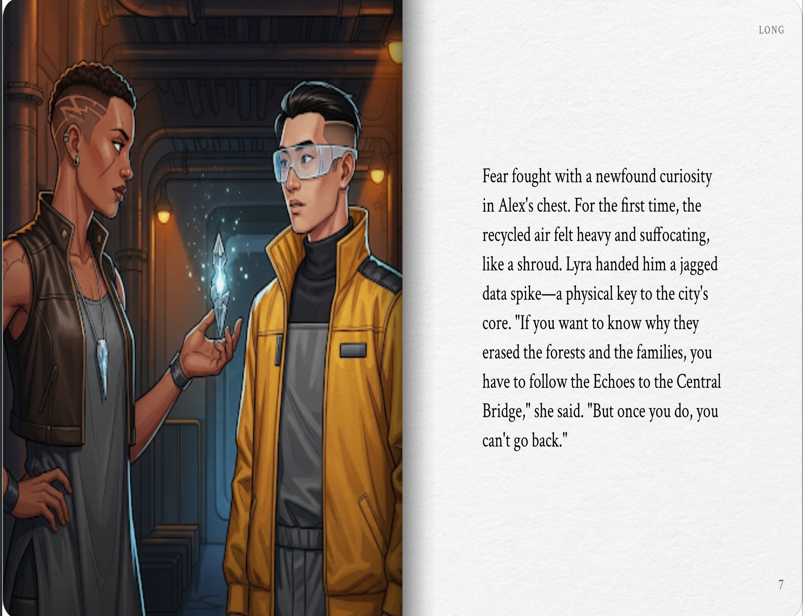
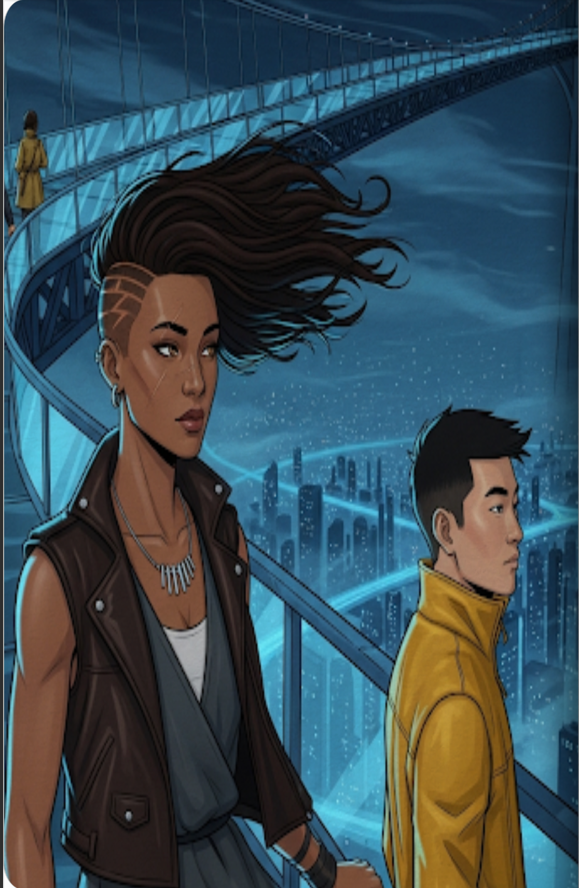
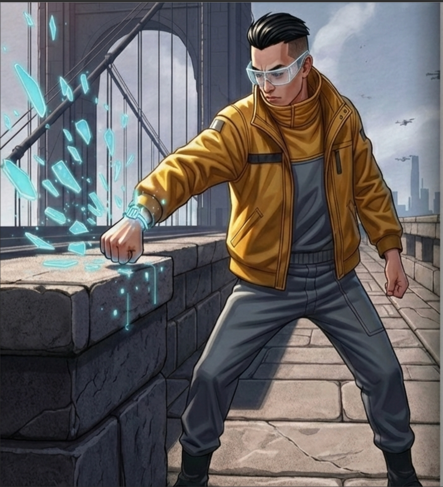

# The Chronos Echoes
**By Long**

---

> *Neo-Veridia was a symphony of artificial light and calculated silence.*

### The Perfect Cog
Alex moved through the city like a ghost in a machine, his soul muffled by the steady hum of corporate mandates. Every day was a loop of neon-blue commutes and recycled air. He was a model citizen, a perfect cog in a clockwork world that never slept and never dreamed. Until the day the rhythm finally broke, and the thirst for something real began to ache.

---

### The Glitch
The glitch happened at the central transit station. Through his augmented reality lenses, the sleek chrome of the walls flickered, replaced for a heartbeat by a ghost of the past—a vibrant, messy marketplace that shouldn't exist. This was an Echo, a fragment of history the Corporate Council had tried to overwrite.

Alex reached out, his fingers trembling as they passed through a holographic basket of fruit that smelled, impossibly, of real earth.

---

### The Encounter
"You're seeing them too, aren't you?" a sharp voice rasped from the shadows.

Alex spun around to find a woman leaning against a rusted terminal in a dark corner of the station. She wore a patched-together jacket of recycled leather and a look of deep suspicion. This was Lyra, a scavenger of secrets who lived in the cracks of Neo-Veridia's perfection. She held a flickering device that hummed with illegal frequencies.

---

### Into the Below
Lyra didn't wait for his permission. She grabbed his arm and dragged him into the 'Below,' the sunless underworld where the city's ancient pipes and forgotten wires groaned. Down here, the neon of the surface was a distant memory. They moved through narrow maintenance tunnels where the air was thick with the scent of ozone and old oil.

---

### A Graveyard of Stories
In the heart of the Below, Lyra activated a forbidden bypass on Alex's AR lenses. Suddenly, the city wasn't just neon and steel; it was a graveyard of stories.

Alex saw layers of life—old graffiti, crumbling brick, and the faces of people long gone—all buried under the corporate architecture. He saw a world that breathed, now trapped beneath a digital shroud.

---

### The Edit
"The Council isn't just managing the city," Lyra explained, her eyes fixed on the streaming data on her tablet. "They're editing it. They delete the parts of history that don't fit their 'Perfect Cog' narrative. If the people remember freedom, they become harder to control."

Above them, a giant red digital sweep passed through the ceiling—a corporate scan searching for any unsanctioned thoughts.

---

### The Key
Fear fought with a newfound curiosity in Alex's chest. For the first time, the recycled air felt heavy and suffocating, like a shroud. Lyra handed him a jagged data spike—a physical key to the city's core.

"If you want to know why they erased the forests and the families, you have to follow the Echoes to the Central Bridge," she said. "But once you do, you can't go back."

---

### The Great Sky Bridge
They reached the Great Sky Bridge at midnight, a massive glass structure suspended high above the smog. Below them, Neo-Veridia stretched out like a glowing, heartless circuit board.

Lyra stood at the edge of the walkway, her hair whipped by the high-altitude winds. "This is the junction," she whispered. "The spot where the old world and the new city were fused together."

---

### Shattering the Link
The corporate sirens began to wail, a dissonant, screaming chord in the city's calculated symphony. Security drones swarmed like angry hornets in the distance.

Alex looked at his wrist, where his identity link pulsed—the mark of a perfect citizen. With a roar of defiance, he slammed his arm against the bridge's heavy stone pier, shattering the glass and metal of his tether.

Lyra watched the shards of the corporate link fall into the abyss, her suspicion finally cracking into a rare smile. The Echoes surged, a tidal wave of truth flowing through Alex's mind. He stepped toward the main control terminal. He wasn't just a cog anymore; he was the Master Architect. As he began to rewrite the city's code, the neon blue began to fade, replaced by the warm, living colors of a world that breathed.
